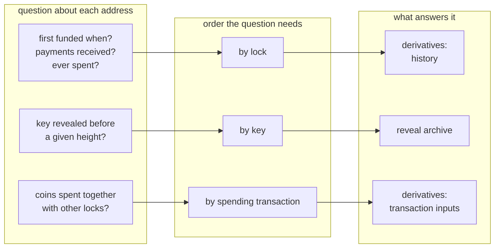

# Example: profiling a set of addresses

This folder is an example, not part of the package. It depends on the
documented capabilities and on nothing else; the rest of the repository does
not depend on it.

## The case that motivated it

In July and August 2026 funds were swept from a large number of wallets.
Public reports attributed the incident to a weak random number generator in
version 4.0.0 of the Coldcard hardware-wallet firmware, released in March 2021:
seeds generated with it could be reconstructed, and whoever reconstructed them
could spend. Studying such an event from the chain means asking questions about
many addresses at once, and most of those questions are not in the order a
node keeps the chain:

| question about each swept address | what it needs |
|---|---|
| when was it first funded, how many payments did it receive, had it ever been spent | the address's history (**by lock**) |
| had its key already appeared on-chain before the sweep | every key ever revealed (**by key**) |
| were its coins ever spent together with coins under other locks | the inputs of each past spending transaction (**by spend**) |



A node answers none of these without re-reading its whole block history, once
per question. With the artifacts, each is a lookup. The script here answers
all three for a list of addresses and prints only aggregates, which is the form
in which such a profile can be shared: the counts, never the list.

Nothing about the incident's addresses is in this folder. The script takes the
list you give it.

## Run it

```sh
python3 examples/address-set-profile/profile.py \
    --index <index-dir> --derived <derived-dir> --archive <archive-dir> \
    --addresses addresses.txt --before <height> [--json]
```

`addresses.txt` holds one mainnet address per line. `--before` is the height
of the event you are studying: first funding and first revelation are then
counted as before or after it. Every capability you leave unconfigured is
reported as `UNSUPPORTED` for every address, never as a negative, and the last
lines say which artifact answered each capability, at which height, under
which fingerprint.

Output, in shape:

```
addresses: 1891 (invalid: 0)
history: {'first funded before': ..., 'never spent': ..., 'seen': ..., 'spent': ...}
receipts: {'1': ..., '2-5': ..., '6-20': ..., '>20': ...}
co_inputs: {'co-spent with other locks': ..., 'never spent': ..., 'spent alone': ...}
exposure: {'never revealed': ..., 'revealed': ..., 'revealed before': ...}
first_height: {'min': ..., 'median': ..., 'max': ...}
```

## What it cost on one real study

Measured on one configuration (artifacts on a USB disk read at ~83 MB/s, the
node reached over REST), during a study of the incident above:

| step | node only | with the artifacts |
|---|---|---|
| profile of 1,891 addresses (first funding, payments received, earlier spends) | a pass over block history, or an address indexer beside the node | about 90 s |
| "was this key revealed before?", 265,869 times | not answerable without re-reading every scriptSig and witness | about an hour, ~17 ms per key |
| every single-source sweep since March 2021 (282,351 blocks), with its fee and the heights of the coins it spent | raw block plus the JSON that carries the spent outputs, 0.64 s per block measured with four concurrent fetches: ~50 h | raw blocks from the node, fees by transaction ordinal from the derivatives: 3 h 41 min with four processes |

The last row is not what this script does; it is there because it is the
same trade in its plainest form. The artifacts themselves cost about 129 hours
of machine time and ~960 GB to build once; `docs/building.md` has the cost of every step.

## What it does not do

- It does not tell an attacker's sweep from a service moving its own deposits
  or an owner moving their own coins. On the incident above, the profile of the
  swept addresses (one payment received, never spent, key never revealed) was
  also the profile of exchange deposit addresses; telling them apart took the
  age of the coins and where the funds went next.
- Taproot key-path addresses reveal their key in the address itself: for them
  the exposure answer is known before any lookup.
- It reads the artifacts up to their height. Blocks after it are the node's.
